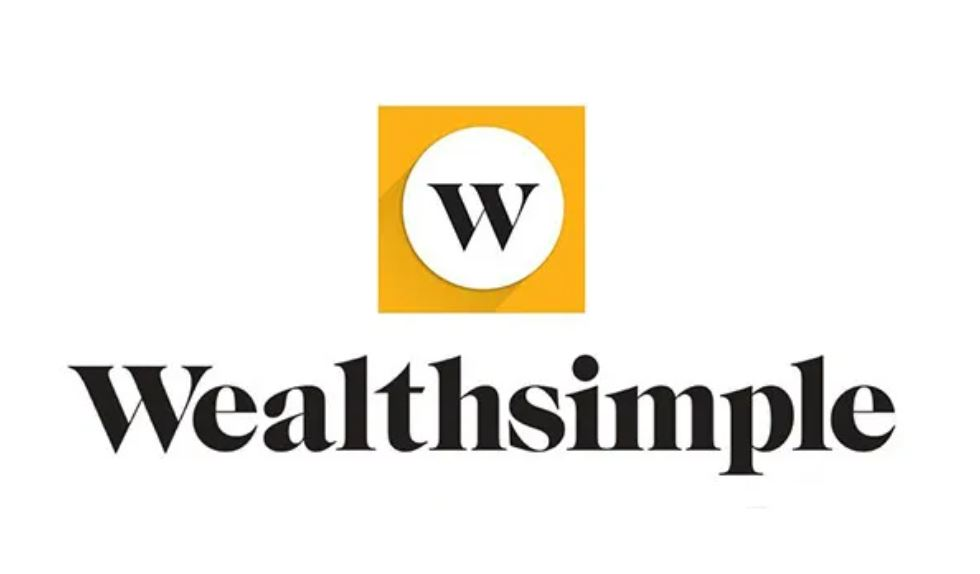

# WealthSimple 

***Founded: September 2014***

***Founders: Michael Katchen (CEO, Rudy Adler (CMO), Brett Huneycutt (CPO)***

***Main Line of Business: Robo-Advisory, Stock Brokerage, Electronic Trading Platform***

*WealthSimple was inspired by an idea to give tips to colleagues and help them build an investment portfolio. Michael Katchen, who worked in Silicon Valley-based Startup developed a spreadsheet with advice for his coworkers. He then took his idea further and created WealthSimple to help regular people invest their money (as little as 1$) by supplementing regular 'in-person' advice with robo-advisory based on user's preferred risk level.*

*Since its inception, WealthSimple has undergone multiple funding rounds and, at its peak in 2021, was valued at more than $5 billion CAD*

**Seed Round - CA1.9M**
**Series A - CA$30M**
**Series B - CA$70M**
**Series C - CA$65M**
**Series D - CA100M**
**Series E - CA114M**
**Series F - CA750M**

#

**IN MORE DETAIL:**

WealthSimple was created to bring the opportunities of the stock market closer to each person. By utilizing new developments in financial technologies, WealthSimple became a user-friendly and financially affordable solution for more people to participate on the stock exchange. The company positions itself as a great fit for any individuals interested to grow their wealth and is designed to help make decisions for all level of investors, but especially focuses on entry-level investors. Its software is designed to make automated decisions on-the-go based on the user's risk preferences. The high-level automation, in return allows WealthSimple fee structure to be highly competitive compared to old-school brokerage houses.

As of Nov 2021, WealthSimple had over 1.5 million users worldwide and managed $15 billion CAD in assets.

2022 has seen a major slowdown in overall market activity, and, as a result, WealthSimple took a direct hit from receding investor activity. The largest shareholder of WealthSimple, IGM Financial, has re-evaluated its WealthSimple assets by 20% less in May of 2022 and then again by nearly half in August of 2022, notably claiming that the re-evaluation is in line with the overall forecast of the upcoming economic downturn and not because of WealthSimple performance or declining potential.

#

**LANDSCAPE & IMPACT**

WealthSimple has grown into a leading Fintech player in Canada and is continues to focus its business on RPA/Artificial Intelligence and Blockchain

**Robo-Advisory powered by AI**

Robo-advisory has evolved quickly in the last decade. Initially gaining ground in the investment world following the 2008 financial crisis in the USA, Robo-advisory has seen a wider adoption starting in 2015 around the globe. Since 2020, with the emergence of global COVID pandemic, automated robo-advisors have taken a significantly bigger share in private and business investment sector, largely driven by young millennials. The largest contributing factor to the growth of robo-advisory sector became the capturing of low and mid-level retail investors. Previously, an average investor had to invest at least $50,000 to utilize the service of a financial planner. On the other hand, robo-advisory investments start from as low as $1.

WealthSimple is a notable example in the automated wealth management sector, because it is the largest fintech company in Canada and outside of the USA by AUM (Assets Under Management). It grew its user-base 10-fold since the end of 2019. South of the border, industry competitors are managing significantly bigger sums of money (Vanguard Personal and Digital Advisor Services - US$ 190 B, Schwab Intelligent Portfolios - US$ 68.5 B, Betterment - US$ 33 B, Wealthfront - US$ 27 B, Personal Capital US$ 22.7 B); however, due to its business model, WealthSimple can be best compared to the American-based Robinhood (with estimated US$ 64.2 B in AUM as of 2022). Although they both promise a no fee trading platform, WealthSimple does charge for currency-conversions. As a result, Wealth simple has, on one side, a great revenue model from those clients who prefer investing directly into American companies, while also having a clear cost-saving advantage for trading Canadian-based companies and ETFs. This will allow them to have a solid market share to continue innovating and picking up speed in the near future.

![image][WSMUM.JPG]

**The Future of WealthSimple and Recommendations**

WealthSimple clearly understands and demonstrates the need and desire to continue to innovate in multiple segments of Fintech and to diversify its revenue stream. On top of their popular trading platform, they are developing and offering services in peer-to-peer cash transfers, crypto, and tax services.

For example, recently WealthSimple has become the first regulated Canadian crypto platform to offer staking for Solana and Ethereum cryptocurrencies.

Given their dominant position in the Canadian Fintech Market, their talented and experienced team, and strong investor backing it is recommended that WealthSimple continues to be on the forefront of Canadian regulatory framework for AI-powered investing and Blockchain-backed technologies. 

In addition to the above, WealthSimple will benefit from considering providing top-notch services in competition with traditional banking, such as insurance products and mortgages/financing products. Adoption of these services in such manner that would cater to their demographically younger customer base would position WealthSimple as a well-rounded leading service provider for the future generation.

#

## SOURCES

1.	https://www.wealthsimple.com/en-ca/about
2.	https://techcrunch.com/2021/05/03/wealthsimple-raises-610m-at-a-4b-valuation/
3.	https://www.crunchbase.com/organization/wealthsimple/company_financials
4.	https://www.theglobeandmail.com/business/article-wealthsimple-valuation-slashed-nearly-in-half-by-largest-shareholder/
5.	https://www.advisoryhq.com/articles/financial-advisor-fees-wealth-managers-planners-and-fee-only-advisors/
6.  https://www.roboadvisorpros.com/robo-advisors-with-most-aum-assets-under-management/
7.  https://www.brokerage-review.com/investing-firm/assets-under-management/robinhood-aum.aspx
8.  https://www.theglobeandmail.com/business/article-igm-slashes-valuation-of-wealthsimple-by-20-per-cent-as-tech-stock/
9.  https://www.cnbc.com/2018/10/10/wealthsimple-will-likely-raise-more-funding-definitely-wants-to-ipo.html
10. https://betakit.com/wealthsimple-becomes-first-regulated-canadian-crypto-platform-to-offer-staking/

[def]: WSMUM.JPG